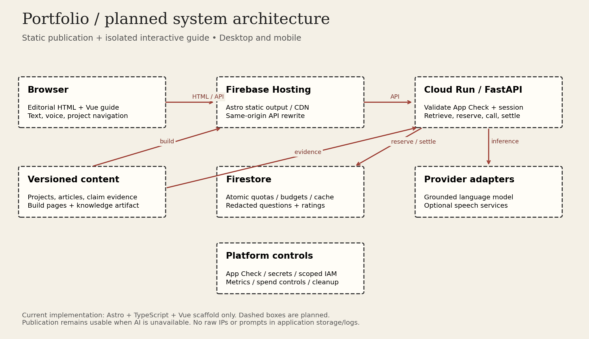

# System Architecture

## Implemented and Planned

Implemented: Astro 7 static frontend, TypeScript, Vue integration, placeholder homepage. Planned: editorial content collections, assistant island, FastAPI service, Firestore, provider adapters, App Check, and cloud deployment.

The diagram is reproducible with `python3 docs/architecture/render-diagram.py` using Matplotlib. Dashed or explicitly planned components are not evidence of deployed services.

## Components

- **Publication:** Astro builds HTML, CSS, optimized assets, and a typed project catalog for Firebase Hosting's CDN.
- **Assistant:** Vue owns transcript, avatar, speech controls, and a validated navigation dispatcher. Other content remains readable without hydration.
- **API:** FastAPI on Cloud Run handles validation, App Check, anonymous sessions, quotas, retrieval, provider calls, and feedback.
- **Knowledge artifact:** one versioned content source feeds both rendered pages and backend evidence. Begin with a small deterministic index; introduce embeddings only if evaluations justify them.
- **Firestore:** distributed counters, budget reservations, bounded cache, redacted questions, and optional feedback. It is not the authoring database.
- **Providers:** model and optional speech services behind interfaces. Concrete providers remain undecided.

## Request Boundaries

Browser requests public pages without authentication. Paid API endpoints validate App Check and a server-issued anonymous session, then reserve quota before calling a provider. Use Firestore transactions across instances; never rely only on in-memory counters. Clients receive citations and an allowlisted action proposal, not executable code.

Prefer a same-origin `/api/v1/*` Firebase Hosting rewrite to Cloud Run. Keep requests within the hosting proxy deadline; avoid long live-audio sessions in the initial version. Browser text-to-speech may bypass the backend when selected. [Hosting serverless integration](https://firebase.google.com/docs/hosting/serverless-overview)

## State and Navigation

Use stable project IDs and canonical routes. Keep assistant state within one Vue island. If Astro client routing is adopted, preserve that island and rebind section anchors on navigation. For ordinary full-page navigation, restore only safe short-lived UI state; never persist transcripts without an explicit decision.

## Failure Behavior

Quota-store failure: deny paid requests. Provider failure: return a clear recoverable error and keep publication navigation available. Unsupported speech: offer text. Invalid action or unknown citation: discard it and do not move the page. Global budget exhausted: disable new paid requests until reset or owner intervention.
