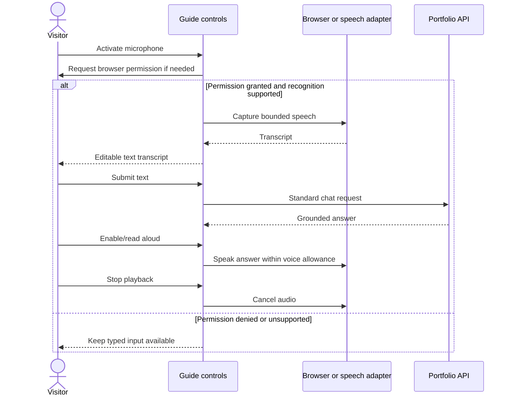

# Optional Voice Sequence

Provider choice is open. The initial voice contract favors push-to-talk and completed answers rather than a permanent realtime audio connection.

If server transcription is selected, define a separate bounded upload endpoint, audio formats, retention, and cost limits before implementation. Do not store audio by default. Disclose external speech processing; browser APIs do not guarantee on-device recognition. Playback must not begin before visitor interaction.
