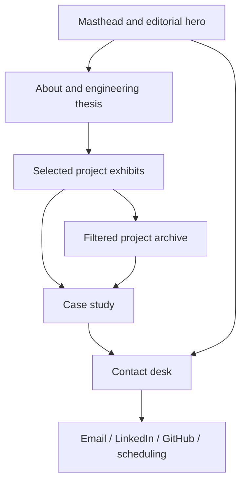

# UI Flow

## Publication

The masthead is the owner's name, not a fictional publication title. Use the agreed subtitle and an editorial lead about making AI useful through production engineering. Retain the site's cream paper, serif headlines, red annotations, diagram exhibits, and thin rules.

## Assistant

Automatic text greeting → visitor opens guide → typed question or explicit microphone activation → listening/thinking → concise answer with citations → scroll and spotlight → visitor may open case study or ask for more depth.

The persistent control is dismissible. Desktop uses an inset panel; narrow screens use an expandable bottom sheet with safe-area and virtual-keyboard handling. Avoid covering contact actions or locking the page scroll unnecessarily. Return focus to the launcher after closing. Announce status using a restrained live region.

## States

| State | UI behavior |
| --- | --- |
| Idle/greeting | Brief text, suggested portfolio questions, no automatic paid inference or audio. |
| Listening | Explicit microphone indicator, stop control, text alternative. |
| Thinking | Progress label and cancellation; prevent accidental duplicate submission. |
| Answering | Text first; optional audio with stop/mute controls. |
| Navigating | Highlight known project; respect reduced motion; preserve visitor control. |
| Rate-limited | Explain reset/fallback; static suggested answers may remain available. |
| Failed | Specific recoverable error; keep the transcript and typed input usable. |

## Desktop and Mobile

Desktop supports multiple editorial columns and comfortable line lengths; mobile stacks content in its semantic order. Diagrams get readable summaries and deliberate zoom/scroll affordances if needed. Skill tables become semantic compact rows rather than overflowing. Test mouse, keyboard, touch, orientation, and screen readers.

See [design language](design-language.md), [wireframes](wireframes/README.md), and [assistant sequence](sequence-diagrams/assistant.md).
